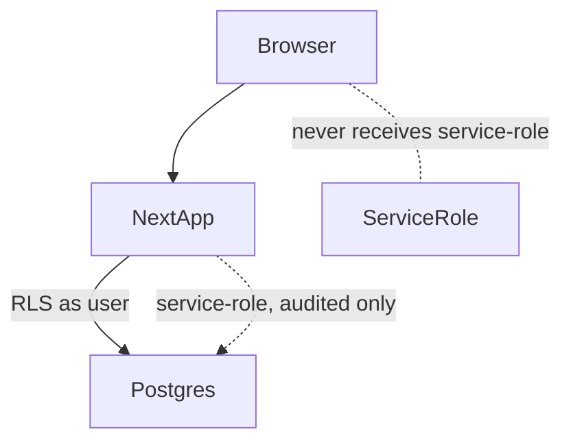

# Behavioral Health Clearinghouse MVP — Technical Architecture & Build Blueprint

**A multi-tenant Behavioral Health Clearinghouse Simulator and Claims Operations Control Plane built on MakerKit Lite.**

| | |
|---|---|
| **Document type** | Decision-grade technical architecture report (executive companion to `CLAUDE_CODE_BUILD_PLAN.md`) |
| **Prepared for** | Local, end-to-end MVP on a single Windows PC — no cloud deployment in this phase |
| **Starter repo** | `makerkit/nextjs-saas-starter-kit-lite` (free "Lite" edition) |
| **Repo commit inspected** | `37def9c20b01a3514cf69b5b3383bef3e5ffbcb9` — last commit dated 2026-01-21 |
| **Repo inspection date** | 2026-07-16 (UTC) |
| **Domain source** | *The Complete U.S. Healthcare Clearinghouse Market Intelligence Report — 2026 Edition* (research cutoff 2026-07-10), cited below as **[MI p.N]** |
| **PHI policy** | 100% synthetic data. Fictional names, `SIM-` identifiers. No real PHI at any point. |

**Evidence labels used throughout:** `[REPO]` verified repository fact · `[STD]` verified healthcare standard / regulatory fact · `[REC]` architecture recommendation · `[SIM]` MVP simulation assumption · `[FUT]` future production requirement · `[NV]` *Not verified — requires implementation or legal validation.*

> **Compliance disclaimer.** Building on Supabase or MakerKit does **not** make this application HIPAA compliant. This MVP is a simulator for architecture, workflow, and UX demonstration. It is **not** a nationally connected production clearinghouse, a certified X12 gateway, a live Medicare/Medicaid/commercial endpoint, a banking/EFT system, or a substitute for legal, HIPAA, security, or X12 licensing review. Acceptance is not payment; a rejection is not a denial **[MI p.4–5]**.

---

## PAGE 1 — Product Scope, MakerKit Audit & System Architecture

### A. MVP objective

Convert the single-tenant MakerKit Lite personal-account starter into a **locally runnable, multi-tenant behavioral-health clearinghouse simulator**. The MVP demonstrates the full administrative claim lifecycle — authenticated users inside customer organizations create professional (837P) and institutional (837I) behavioral-health claims; the system validates them, generates scoped synthetic X12, simulates clearinghouse acknowledgments (TA1 / 999 / 277CA), simulates payer adjudication, produces synthetic 835 remittances with adjustments, and exposes a complete, checkpoint-by-checkpoint transaction trace. It adds a searchable database-driven payer directory, an explainable versioned rule engine, an audited customer-support portal, private document storage, org/user administration, append-only audit logging, and a Python end-to-end test client that submits ten synthetic claims (exactly eight paid, exactly two denied after adjudication).

### B. Scope boundaries

| Local MVP capability (this phase) | Simulated payer capability `[SIM]` | Future production capability `[FUT]` | Explicitly excluded |
|---|---|---|---|
| Multi-tenant orgs, RBAC, RLS, claims, trace, remittance, support, audit — all local | TA1/999/277CA acks, adjudication, 835, EFT trace are deterministic simulations | Real trading-partner routes, enrollment graph, durable queues, DLQs, webhooks | Live payer connectivity; certified X12 gateway |
| Synthetic 837P/837I subset | Ten `SIM-` payer profiles, not real routes **[MI p.9]** | Governed terminology service (ICD-10/CPT/HCPCS effective-dated) **[MI p.6]** | Banking/ACH money movement **[MI p.4]** |
| Runs on localhost + local Supabase (Docker) | Two explainable denials in the 10-claim demo | SOC 2 / HITRUST assurance, BAAs, pen tests **[MI p.13]** | Real PHI; CPT/CDT/X12 licensed content copies |

### C. MakerKit Lite gap assessment `[REPO]`

Assessed against commit `37def9c2`. **Reused where legally available in the Lite repo only** — no code is copied from the paid MakerKit Pro/Teams products.

| Capability | In Lite? | Reusable component / path | Missing | Required modification | MVP priority |
|---|---|---|---|---|---|
| Authentication | ✅ | `packages/features/auth` (password, magic-link, OAuth, MFA); `apps/web/app/auth/*` | — | Reuse as-is | P0 (keep) |
| Protected routes | ✅ | `apps/web/middleware.ts` (CSRF, MFA gate, request-id); `app/home/*` | — | Extend matcher for `/support`, `/admin` | P0 |
| User profile | ✅ | `packages/features/accounts` (`public.accounts` table) | — | Rename concept to `user_profiles`; keep 1:1 to `auth.users` | P1 |
| Organizations | ❌ | none — Lite is **personal-account only** | Entire org/tenant model | New `organizations` + `organization_id` on every tenant table | P0 |
| Team membership | ❌ | none | Memberships, roles per org | New `organization_memberships` | P0 |
| Invitations | ❌ | Email templates exist (`supabase/templates/invite-user.html`) | Invite table + flow | New `invitations` + accept flow | P1 |
| Custom roles | ❌ | none | Role/permission model | New `roles`,`permissions`,`role_permissions` | P0 |
| Platform administration | ❌ | none | Super-admin surface | New `app/admin/*` + guarded server layer | P1 |
| Customer-support administration | ❌ | none | Support portal + audited access | New `app/support/*` + `support_access_sessions` | P1 |
| Database schema | ⚠️ | 1 migration `20241219010757_schema.sql` (accounts only) | All domain tables | ~40 new tables via new migrations | P0 |
| Row-Level Security | ⚠️ | RLS enabled on `accounts` (`accounts_read/_update` policies) — pattern to copy | Tenant-scoped policies | Org-scoped policy on every table | P0 |
| File storage | ⚠️ | 1 bucket `account_image` — **PUBLIC** | Private buckets, signed URLs | New **private** `claim_documents`/`support_documents` buckets | P0 |
| Notifications | ❌ | not in Lite | In-app notifications | Optional `notifications` table (MVP-lite) | P2 |
| Audit logs | ❌ | none | Append-only audit | New `audit_events` (insert-only, no update/delete policy) | P0 |
| Background jobs | ❌ | none | Processor/worker | New `apps/worker` + `processing_jobs` | P1 |
| API layer | ⚠️ | Server Actions + `data-loader-supabase`; only `app/version` & `sitemap` route handlers | Versioned REST for Python client | New `app/api/v1/*` route handlers | P0 |
| Test infrastructure | ⚠️ | Playwright e2e (`apps/e2e`, auth+account); `supabase db test` (pgTAP) | Unit runner, RLS tests, Python E2E | Add Vitest, pgTAP RLS tests, `tools/edi-simulator` | P0 |
| Monitoring | ⚠️ | `instrumentation.ts`, request-id, pino logging | App metrics | Structured trace events (in-DB) | P2 |
| Documentation | ⚠️ | README only | Product/impl docs | New `docs/*` + `CLAUDE.md` | P0 |

**Stack actually present `[REPO]`:** Next.js 15.5.9 · React 19.2.1 · TailwindCSS 4.1.14 · Shadcn UI (`@kit/ui`) · Supabase-js 2.75.0 · Zod 3.25 · React Query 5.90 · `@tanstack/react-table` 8.21 · react-hook-form 7.65 · i18next · Turborepo 2.5.8 · pnpm 10.18.2 · Node ≥18.18 · TypeScript 5.9. Service-role key is already guarded server-only (`packages/supabase/src/get-service-role-key.ts` and `server-admin-client.ts` both `import 'server-only'`).

### D. Container architecture (C4-style)

See **`architecture-context.mmd`** (rendered on PDF page 1). The browser receives only the anon JWT; the `SUPABASE_SERVICE_ROLE_KEY` lives exclusively in server code (`apps/web` server actions/route handlers + `apps/worker`) and is used only on audited, privileged paths. All ordinary reads/writes run as the end user so PostgreSQL RLS enforces tenant isolation.

---

## PAGE 2 — Product Modules & End-to-End Claim Workflow

### Application navigation

**Customer** (`app/home/*`): Dashboard · Claims (New Professional / New Institutional) · Claim Batches · Claim Work Queue · Transaction Trace · Remittances · Payment Reconciliation · Payers · Documents · Support · Users & Access · Organization Settings · Audit History.

**Support team** (`app/support/*`): Support Dashboard · Ticket Queue · Assigned Tickets · Customer Search · Customer Summary · Claim Trace Viewer · Document Viewer · Escalations · Internal Notes · Support Access Log.

**Platform admin** (`app/admin/*`): Organization Management · User Management · Role Management · Global Payer Directory · Payer Rule Management · Simulator Configuration · System Jobs · Audit Events · Test Runs · System Settings.

### Claim-type scope (deliberate subset)

**Professional — 837P subset** for psychiatrists, psychologists, licensed therapists, and BH groups: outpatient therapy, psychiatric evaluation, individual/group/family therapy, medication management. Supported: subscriber/patient, rendering & billing provider (NPI), diagnosis pointers (ICD-10-CM), service lines (CPT/HCPCS + modifiers, units, POS), claim-level totals.

**Institutional — 837I subset** for inpatient psychiatric facilities, BH hospitals, PRTF, PHP, and IOP: facility (type-of-bill), admission/discharge, revenue codes, HCPCS where required, occurrence/value/condition placeholders, diagnosis set.

**Unsupported loops (documented, not silently dropped) `[SIM]`:** COB/secondary payer loops, ambulance/spinal certification, drug (LIN/CTP) detail, full 2300 claim-level attachments, propertied 2420 loops beyond rendering provider, and NCPDP pharmacy. These are validated-as-out-of-scope with an explicit "unsupported loop" message rather than accepted.

### Claim lifecycle — sequence + state machine

Sources: **`claim-lifecycle-sequence.mmd`** and **`claim-state-machine.mmd`** (rendered on PDF page 2). Lifecycle: Draft → Validating → (Validation Failed) → Validated → EDI Generated → Submitted → TA1 → 999 → 277CA → Accepted for Adjudication → Adjudicating → Paid / Partially Paid / Denied → 835 Received → EFT Matched → Posted → Corrected/Resubmitted → Closed **[MI p.5]**.

**Trace event fields (every checkpoint):** event name · event category · timestamp · actor / system component · claim ID · batch ID · interchange control number (ISA13) · group control number (GS06) · transaction-set control number (ST02) · payer · route · request payload hash · response payload hash · status · error/denial code · human-readable explanation · rule ID · correlation ID · previous event · next recommended action **[MI p.7, p.14]**.

> **Rejection vs. denial — hard rule `[STD] [MI p.5]`.** A **rejection** occurs *before* the claim is accepted into adjudication (TA1 / 999 / 277CA). A **denial** occurs *after* adjudication (in the 835 with CARC/RARC). The dashboard must report a **rejection rate** and a **denial rate as two separate metrics** and never merge them.

---

## PAGE 3 — Data Model, Multi-Tenancy, Security & Access Control

### ERD

See **`data-model-erd.mmd`** (rendered on PDF page 3). Entity groups: **Identity/tenancy** (`user_profiles`, `organizations`, `organization_memberships`, `roles`, `permissions`, `role_permissions`, `invitations`, `support_access_sessions`); **Provider/coverage** (`providers`, `facilities`, `patients`, `subscribers`, `coverages`, `organization_payer_enrollments`); **Payer** (`payers`, `payer_aliases`, `payer_routes`, `payer_supported_transactions`, `payer_rules`, `payer_rule_versions`, `payer_test_profiles`); **Claims** (`claims`, `professional_claim_details`, `institutional_claim_details`, `claim_diagnoses`, `claim_lines`, `claim_documents`, `claim_relationships`, `claim_batches`); **EDI/trace** (`edi_transactions`, `edi_payloads`, `transaction_events`, `acknowledgments`, `processing_jobs`, `rule_evaluations`, `replay_attempts`); **Remittance** (`remittances`, `remit_claims`, `remit_service_lines`, `claim_adjustments`, `eft_traces`, `payment_matches`); **Support/docs** (`support_tickets`, `support_messages`, `support_assignments`, `support_ticket_documents`, `documents`, `document_access_events`); **Governance** (`audit_events`, `system_settings`, `test_runs`, `test_run_results`).

**Every tenant-owned table carries:** `organization_id` (FK, NOT NULL) · `created_at` · `created_by` · `updated_at` · `updated_by` · `deleted_at` (soft delete) · index on `(organization_id, created_at)` and on foreign keys · an RLS policy scoping rows to the caller's org memberships · a retention note. `audit_events` and `transaction_events` are **append-only** (INSERT policy only; no UPDATE/DELETE grant).

### Role–permission matrix (abridged; `E`=in support access session only)

| Action | Platform Super Admin | Support Mgr | Support Agent | Org Owner | Org Admin | Claims Mgr | Claims Spec. | Remit Spec. | Read-Only Auditor |
|---|:--:|:--:|:--:|:--:|:--:|:--:|:--:|:--:|:--:|
| Create/Invite users | ✅ | — | — | ✅ | ✅ | — | — | — | — |
| Assign roles | ✅ | — | — | ✅ | ✅ | — | — | — | — |
| Create/Edit claims | — | — | — | ✅ | ✅ | ✅ | ✅ | — | — |
| Approve/Submit claims | — | — | — | ✅ | ✅ | ✅ | — | — | — |
| Correct/Resubmit | — | — | E | ✅ | ✅ | ✅ | ✅ | — | — |
| View remittances | — | E | E | ✅ | ✅ | ✅ | ✅ | ✅ | ✅ |
| Post payments | — | — | — | ✅ | ✅ | — | — | ✅ | — |
| Edit payers / payer rules | ✅ | — | — | — | — | — | — | — | — |
| View / Download documents | — | E | E | ✅ | ✅ | ✅ | ✅ | view | view |
| Open support tickets | — | ✅ | ✅ | ✅ | ✅ | ✅ | ✅ | — | — |
| View all organizations | ✅ | ✅ | ticket-scoped | — | — | — | — | — | — |
| Enter support-access session | — | ✅ | ✅ (w/ auth) | — | — | — | — | — | — |
| Export data | ✅ | — | — | ✅ | ✅ | — | — | — | ✅ |
| View audit logs | ✅ | ✅ | own actions | ✅ | ✅ | — | — | — | ✅ |

### Audited support access (no silent impersonation)

Support staff do **not** get blanket PHI access **[MI p.14]**. A support-access session requires: an assigned ticket · a typed reason · customer or manager authorization where appropriate · a time limit (auto-expiry) · least-privilege (read-only unless explicitly granted) · a prominent "SUPPORT ACCESS ACTIVE" banner · start/end timestamps · a full audit trail · no claim-data edits unless specifically granted. Access is enforced by RLS policies that check for an active, unexpired `support_access_sessions` row.

### Security requirements `[REC]`

Supabase RLS on every table · service-role key server-only (already true in Lite `[REPO]`) · **private** Storage buckets + short-TTL signed URLs · file size/type allowlist · malware-scan integration point `[FUT]` · password policy + MFA-ready (Lite already has MFA plumbing) · session management · least privilege · tenant isolation · secrets in `.env.local` (never committed) · append-only audit · sensitive-field logging restrictions (no PHI in logs) · rate limiting on `/api/v1` · Zod input validation · CSRF (Lite middleware already enforces) · secure headers · dependency scanning · backup/recovery via `supabase db dump` · **synthetic data only** locally.

> Using Supabase/MakerKit does **not** confer HIPAA compliance `[STD]`. Compliance requires a covered-entity risk analysis, BAAs, and independent assurance **[MI p.13]** — out of scope for this local MVP.

---

## PAGE 4 — Payer Directory, Rule Engine, EDI Simulator & Ten-Claim Test

### Payer master directory (database-driven, not a hardcoded dropdown)

Operations: search · filter · sort · add · edit · deactivate · reactivate · soft delete · import CSV · export CSV · view supported claim types/transactions · enrollment requirements · route info · effective dates · rule versions. Fields: internal UUID · display name · legal name · category · line of business · state/national scope · public program ID (when applicable) · clearinghouse-specific payer ID · network name · claim types supported · transactions supported · enrollment required · test/production designation · effective date · termination date · active status · notes · source · last-verified date. **Seed = ten `SIM-` profiles** clearly labeled as simulated; the import pipeline supports loading a larger directory later. **A payer ID is not universal across networks and the ten routes are not real production routes [MI p.4, p.9] `[SIM]`.**

### Payer rule engine (explainable, versioned)

Each rule: rule ID · payer · claim type · service category · field/data path · condition · outcome · severity · **rejection-vs-denial designation** · human-readable explanation · suggested correction · effective date · expiration date · source · version · active status · test cases. Five categories, evaluated in order: (1) universal MVP validations, (2) claim-type validations, (3) payer-specific simulated edits, (4) adjudication rules, (5) informational warnings. **The engine never silently alters clinical or billing facts [MI p.14] `[REC]`** — it records an explainable `rule_evaluations` row and, where relevant, suggests a correction.

### Ten-claim end-to-end demonstration `[SIM]`

Six professional + four institutional claims across simulated payer categories (Medicare FFS-style, Medicare Advantage-style, Medicaid FFS-style, Medicaid managed-care, commercial PPO, commercial HMO, Blue-plan, TRICARE-style, Marketplace-style, regional BH payer). **All ten** pass local schema validation, receive successful **TA1 → 999 → 277CA**, and enter adjudication. **Exactly eight are paid; exactly two are denied *after* adjudication.** Paid claims get synthetic 835 data with payment + adjustment detail and a simulated EFT trace; denied claims have **no** matched EFT deposit and display the triggering rule, trace event, and recommended next action.

**Two explainable BH denial scenarios:**

1. **Required prior authorization missing/invalid** (e.g., PHP/IOP day without a valid auth on the simulated payer profile).
2. **Benefit limit exhausted** (e.g., annual outpatient-therapy visit cap reached under the simulated plan).

> **Code-set integrity `[STD]`.** CARC/RARC meanings must be verified against authoritative sources before display; do **not** invent official code meanings **[MI p.6, p.14]**. Where a proprietary/authoritative meaning cannot be reproduced offline, use an internal simulation code prefixed `SIM-` and label it clearly. The two denials must **never** be mislabeled as intake rejections.

### Python test client — `tools/edi-simulator/submit_10_test_claims.py`

Runs against localhost; authenticates via a seeded test account/local token; loads ten synthetic fixtures; generates/loads scoped 837P/837I payloads; submits each transaction; preserves control + correlation IDs; polls status; retrieves the full trace and remittance records; prints a terminal summary; **asserts 8 paid, 2 denied, and that neither denial is recorded as an intake rejection**; exits non-zero on failure; is repeatable via idempotency keys; supports `--base-url`, `--reset`, `--seed`; and emits JSON evidence. Supporting files: `requirements.txt`, `pytest.ini`, `fixtures/payers.json`, `fixtures/claims/`, `fixtures/expected-outcomes.json`, `tests/test_end_to_end.py`.

**Negative tests (separate):** TA1 rejection · 999 rejection · 277CA rejection · duplicate submission · invalid tenant access · unauthorized role · missing document · unsupported payer route. **The two adjudication denials must not fail at the acknowledgment stages.**

---

## PAGE 5 — Claude Code Implementation Roadmap & Acceptance Criteria

### API & processing decisions `[REC]`

- **API strategy:** **Server Actions for UI mutations** (matches Lite's existing pattern and CSRF handling) **plus versioned Route Handlers under `app/api/v1/*`** for the Python client and machine access. Supabase RPC only for set-based DB logic; a lightweight `apps/worker` for processing. This is a firm recommendation, not a menu.
- **Processing:** MVP processes **synchronously via a deterministic processor invoked from the submit path**, writing an immutable `transaction_events` row per transition — simple to build, easy to test. Structure it behind a `ClaimProcessor` interface + a `processing_jobs` table so it can later move to durable queues, separate workers, retries, DLQs, and webhooks **[MI p.7, p.15]** without a rewrite. **Abstractions to create now:** canonical claim model, `processing_jobs`, immutable event log, idempotency keys, and a rule-evaluation record.
- **Cross-cutting for `/api/v1`:** JWT auth · role/permission authorization · Zod validation · idempotency keys · structured error envelope · correlation IDs · pagination + filtering · audit generation · single DB transaction per state change.

### Repository change map (adapt to actual MakerKit conventions `[REPO]`)

`apps/web/app/{home/(customer),support,admin,api/v1}` · `apps/web/supabase/{migrations,schemas,seed.sql,tests}` · `packages/features/{organizations,access-control,claims,edi,payers,payer-rules,remittances,transaction-trace,documents,support,audit}` · `packages/shared`, `packages/ui` (reuse) · `apps/worker` · `tools/edi-simulator` · `docs/{architecture,implementation,progress,tests}`. Keep MakerKit's `@kit/*` package boundaries and Server-Action conventions; do not force structure that conflicts with them.

### Required Claude Code docs (create & keep updated)

`CLAUDE.md` · `docs/00-product-scope.md` · `docs/01-repository-baseline.md` · `docs/02-architecture.md` · `docs/03-data-model.md` · `docs/04-rbac-and-rls.md` · `docs/05-claim-lifecycle.md` · `docs/06-payer-rules.md` · `docs/07-test-scenarios.md` · `docs/08-local-runbook.md` · `docs/progress/{CURRENT_STATE,PROGRESS,DECISIONS,CHANGELOG_IMPLEMENTATION,KNOWN_ISSUES,TEST_EVIDENCE}.md`.

### Ten implementation phases

Each phase in `CLAUDE_CODE_BUILD_PLAN.md` specifies: objective · preconditions · files to inspect · files to create · files to modify · migrations · commands · tests · expected visible result · acceptance criteria · rollback · doc updates · conventional commit message. **Claude Code must not start a phase until the previous one passes its acceptance criteria.**

| # | Phase | Exit gate |
|---|---|---|
| 0 | Repo baseline & safety (clone, record SHA, install, `supabase start`, run tests/lint/typecheck, branch) | Baseline recorded; no behavior change |
| 1 | Branding, navigation, protected route skeletons | Auth still works; empty routes render |
| 2 | Organizations, memberships, roles, RLS + negative RLS tests | Cross-tenant read denied |
| 3 | Providers, facilities, patients, coverages (synthetic) | Org-owned CRUD + validation |
| 4 | Payer directory + versioned payer-rule admin | Search/filter/CRUD + 10 `SIM-` payers |
| 5 | 837P + 837I builders (lines, dx, docs, draft/approval) | Draft→approve→submit works |
| 6 | EDI processor + trace graph (TA1/999/277CA, state machine, idempotency) | Full trace visible; replay-safe |
| 7 | Adjudication sim + 835 + reconciliation (8 paid / 2 denied, adjustments, EFT match) | Remittance UI shows pay/deny correctly |
| 8 | Support portal, private docs, time-limited support access, append-only audit | Support access banner + audit rows |
| 9 | Python client + pytest + Playwright + RLS/API tests + evidence | 10 claims: 8 paid, 2 denied, repeatable |
| 10 | Hardening & local demo release (all tests, reseed, verify roles/isolation/traces, runbook, tag) | Green suite; tagged MVP |

### Git & progress rules

Feature branch · inspect before editing · don't replace working MakerKit patterns · show plan before changing files · one phase at a time · run format/lint/typecheck/tests after each phase · review `git diff` · update progress markdown · save migration + test output · commit per successful phase · conventional commits · never commit `.env`/secrets/service-role keys/real health data · stop and document blockers instead of inventing behavior · keep the app runnable at the end of every phase.

### Final local-MVP acceptance criteria (all must be true)

App runs locally; local Supabase starts via Docker; sign-up/seeded login works; multiple orgs exist; cross-org reads denied; roles produce visibly different permissions; org admin can manage users; users create professional and institutional claims and save drafts; authorized users approve/submit; payers searchable/add/edit/deactivate; payer rules versioned + explainable; transaction trace shows every checkpoint; **rejections and denials displayed separately**; remittances searchable/viewable; documents private; support tickets create/assign; support access restricted + audited; audit rows for security-sensitive actions; Python script submits ten claims — **exactly eight paid, exactly two denied after adjudication**; paid claims have simulated 835; denied claims show rule + next action; test re-runs without duplicates; existing MakerKit auth still works; TypeScript, lint, Playwright, Python, and RLS-isolation tests all pass; no real PHI; no production payer connectivity implied.

---

## Testing strategy (test pyramid) `[REC]`

- **Unit (add Vitest — not currently installed `[REPO]`):** claim validation, state transitions, role permissions, payer-rule evaluation, adjustment math, control-number generation, idempotency.
- **DB/RLS (pgTAP via `supabase db test` — already available `[REPO]`):** same-tenant access, cross-tenant denial, support-session access, expired support access, platform-admin access, unauthorized payer-rule modification.
- **API integration:** create/update/submit claim, duplicate submission, retrieve trace, retrieve remit, payer CRUD, ticket creation.
- **Browser (Playwright — already present `[REPO]`):** login, role-specific nav, professional + institutional claim creation, submission, trace, remittance, payer search, support workflow.
- **Python E2E:** ten claims → eight paid, two denied, complete trace, repeatable.

## Assumptions & limitations

`[SIM]` All payers, patients, providers, claims, remittances, and EFT traces are synthetic; `SIM-` IDs; no PHI. · `[SIM]` Acks and adjudication are deterministic local simulations, not payer responses. · `[NV]` Exact CARC/RARC display strings must be validated against authoritative CMS/X12 sources at build time; unverified codes are shown as `SIM-`. · `[FUT]` Production would require a governed terminology service, real enrollment graph, durable queues/DLQs, SOC 2/HITRUST, BAAs, and X12/CPT/CDT licensing **[MI p.6, p.13, p.15]**. · `[NV]` HIPAA compliance is **not** achieved by this MVP. · `[REPO]` All repository facts verified at commit `37def9c2` on 2026-07-16; if README, structure, and versions disagree, the actual repo files are authoritative.

## Sources

- *The Complete U.S. Healthcare Clearinghouse Market Intelligence Report — 2026 Edition* — cited inline as **[MI p.N]** (claim lifecycle p.5; transaction/code-set map p.6; reference architecture p.7; segment reality p.9; data model/observability/AI p.14; opportunities p.15; implementation blueprint p.16; compliance p.13; evidence labels p.19).
- MakerKit Lite repository `makerkit/nextjs-saas-starter-kit-lite` @ `37def9c20b01a3514cf69b5b3383bef3e5ffbcb9`, inspected 2026-07-16 — files cited inline as `[REPO]`.
- Referenced authoritative sources named in the market report **[MI p.20]**: CMS Administrative Simplification / adopted standards & operating rules; CMS-0057-F Interoperability & Prior Authorization Final Rule; HHS OCR HIPAA Privacy/Security/Breach rules; CAQH 2024 Index. Revalidate against primary sources during implementation.
